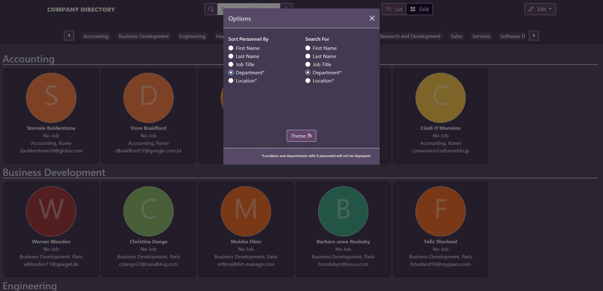
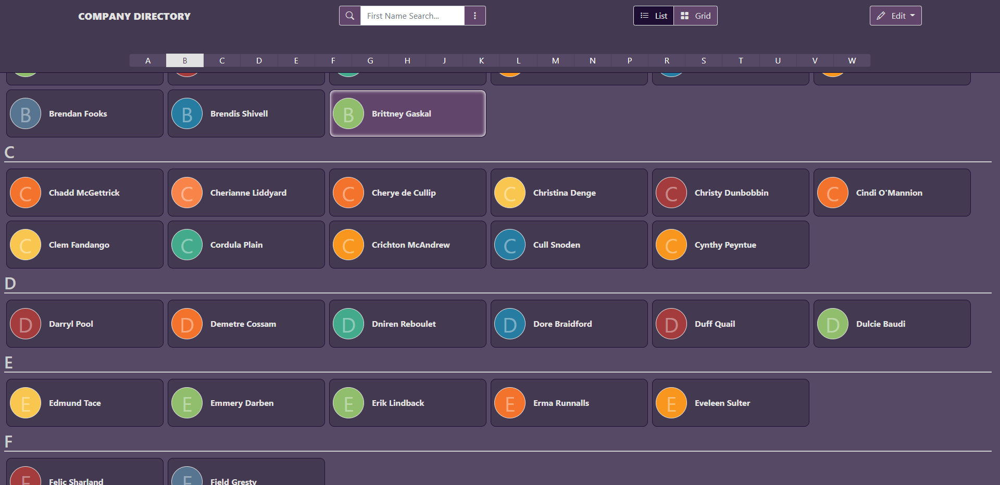
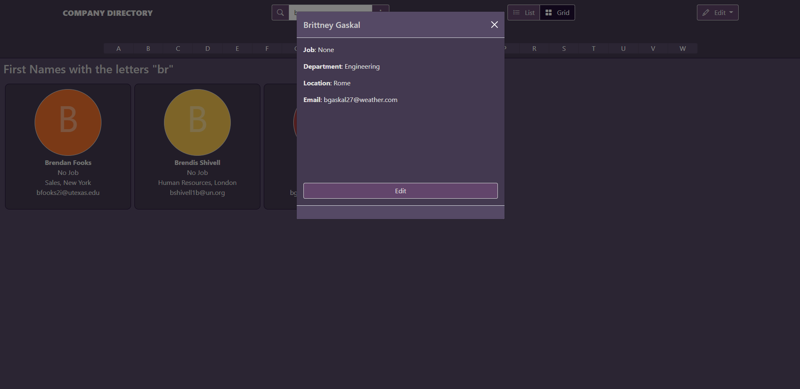
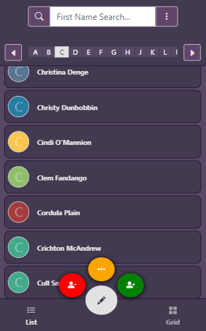
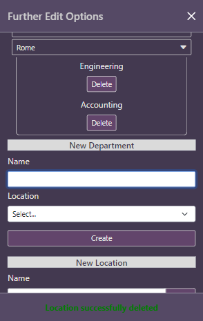

# COMPANY DIRECTORY
>  A desktop website that can also run on a mobile that allows for the maintenance of a company personnel database to see who’s who, which department they are in and where they are.

## Table of Contents
* [General info](#general-info)
* [Screenshots](#screenshots)
* [Technologies Used](#technologies-used)
* [How To Use](#how-to-use)
* [How It Works](#how-it-works)
    * [Get Personnel](#get-personnel)
    * [Add Personnel](#add-personnel)
    * [Deleting Personnel](#deleting-personnel)
* [Status](#status)
* [Demo](#demo)
* [Contact](#contact)

## General Info
The main functionaility of the program involves the ability to add, delete and update personnel in a database. This is done through the use of Ajax calls to the PHP server, which validates the data received, performs specific SQL queries to alter the database and finally it outputs the result to the user. Other functionaility includes: 
* Adding new departments and locations. 
* Deleting departments and locations (provided they contain no more personnel within them).
* Sorting personnel e.g. Last Name.
* Searching personnel by criteria e.g. Department.
* Change view between List (shows basic information on personnel) and Grid (shows more detailed information on personnel).

## Screenshots

## Technologies Used
* Html 5 and CSS
* Bootstrap 5
* Bootstrap Icons 1.4.0
* JQuery 3.6.0
* PHP 7.4.12 and cURL
* MySQL/MariaDB 10.4.16

## How To Use
Add the sql found within the php folder to your MySQL/MariaDB database in your local server. To understand how to setup a local server, and how you connect to a database I recommend watching the [Dani Krossing PHP Tutorials](https://www.youtube.com/playlist?list=PL0eyrZgxdwhwBToawjm9faF1ixePexft-) - in particluar: 
* [Installing A Local Server for PHP](https://www.youtube.com/watch?v=mXdpCRgR-xE&list=PL0eyrZgxdwhwBToawjm9faF1ixePexft-&index=2&t=348s&ab_channel=DaniKrossingDaniKrossingVerified)
* [How to Create a MySQL Database for PHP](https://www.youtube.com/watch?v=u10xZgNpfCQ&list=PL0eyrZgxdwhwBToawjm9faF1ixePexft-&index=29&ab_channel=DaniKrossingDaniKrossingVerified)
* [How to connect to a database in PHP](https://www.youtube.com/watch?v=ILyf16MEvHM&list=PL0eyrZgxdwhwBToawjm9faF1ixePexft-&index=36&ab_channel=DaniKrossingDaniKrossingVerified)

To connect to this database, you must create a config.php file inside the php folder (found within libs). Then, inside config.php the following code must go:

    `$cd_host = "127.0.0.1";
	$cd_port = 3306;
	$cd_socket = "";
	$cd_user = "root"; // user name
	$cd_password = ""; // password
	$cd_dbname = "companydirectory"; // database name`

## How It Works
Below includes basic examples of how the code for getting, adding and deleting personnel works.

### Get Personnel
* JS:
    Whenever the radio toggle for sorting personnel is changed or when a person is added/updated to the database, a call to the server to get all personnel is processed. The result is then formatted depending on which radio sorting button is currently on (in the code below it is sorting by first name). The data is then added to the DOM by the function addHtml(). Also, the function moreDetails() adds button functionailty so that when you click on a person, their details will appear in a modal for you to edit.

        `$.ajax({
            url: "./php/personnel/getAll.php",
            type: "POST",
            dataType: 'json',
            success: function(result) {
                var dataToSort = result.data;

                // SORT FIRST NAME ALPHABETICALLY
                var firstNames = dataToSort.sort(function(a, b) {
                    var textA = a.firstName.toUpperCase();
                    var textB = b.firstName.toUpperCase();
                    return (textA < textB) ? -1 : (textA > textB) ? 1 : 0;
                });

                // `REDUCE` OVER THE DATA TO PRODUCE AN OBJECT
                const obj = firstNames.reduce((acc, c) => {
                    // TAKE FIRST LETTER OF NAME AS KEY
                    const letter = c.firstName[0];
                    // ACC VALUE IS JOINED BY C
                    acc[letter] = (acc[letter] || []).concat(c);
                    return acc;
                }, {});
                
                // `MAP` OVER THE OBJECT ENTRIES TO RETURN AN ARRAY OF OBJECTS
                var firstNamesAtoZ = Object.entries(obj).map(([letter, personnel]) => {
                    return { letter, personnel }
                });

                // CALL ADD TO DOM FUNC
                addHtml(firstNamesAtoZ);

                // CALL PERSON MODAL FUNC
                moreDetails(dataToSort);
            }  
        })`

### Add Personnel
* JS:
    When adding personnel, a modal will appear with a form to fill out for the user. On submission, an Ajax call sends data to be first validated via newPersonValid.php, and if this is successful it is then added using another script: insertPersonnel.php. The response must be appropriate for the different types of validation fails - as shown in the code example below.

        `$.ajax({
            url: "./php/personnel/newPersonValid.php",
            type: "POST",
            dataType: 'json',
            data: {
                'nameF': nameF,
                'nameL': nameL,
                'job': job,
                'dep': dep,
                'email': email
            },
            success: function(result) {
                console.log(result);
                if (result.data === "new person created") {
                    console.log('%c Adding Person', 'color: blue; font-weigth: bold')
                    // show successful message
                    $(".form-message").addClass("btn-good");
                    $(".form-message").text("EMPLOYEE CREATED");
                    // clear all inputs
                    $(`#personInputFname, #personInputLname, #personInputJob ,#personInputDep ,
                    #personInputEmail`).val("")
                    // refresh data
                    firstNameSorter() 
                    // ensure first name sort radio is checked
                    $('#sortFN').click();
                } else {
                    //  show error messages
                    $(".form-message").addClass("btn-fail");
                    if (result.data === "empty error") {
                        $(`#personInputFname, #personInputLname, #personInputJob ,#personInputDep,
                        #personInputEmail`).addClass("input-error");
                        $(".form-message").text("Fill in all fields");
                    }
                    if (result.data === "name error") {
                        $("#personInputFname, #personInputLname").addClass("input-error");
                        $(".form-message").text(`Name not valid - names cannot include characters such as "@"`);
                    }
                    if (result.data === "email error") {
                        $("#personInputEmail").addClass("input-error");
                        $(".form-message").text("Email not valid");
                    }
                    if (result.data === "job length error") {
                        $("#personInputJob").addClass("input-error");
                        $(".form-message").text("Job must have more than 3 characters");
                    }
                    if (result.data === "person already exists") {
                        $(`#personInputFname, #personInputLname, #personInputJob ,#personInputDep ,
                        #personInputEmail`).addClass("input-error");
                        $(".form-message").text("Employee already exists");
                    } 
                }
            },
            error: function (request, status, error) {
                console.log(request.responseText);
                
            }
        });`

### Deleting Personnel
* JS:
    The user can select multiple personnel to delete. Once these are chosen, a modal is shown where the user can confirm or cancel that these personnel are going to be removed from the database. If the user clicks the confirm delete button, an ajax call to the file deletePersonnel.php runs a SQL query to delete the selected personnel. 

        `$('.deleteAll').on('click', function (e) {

            // DELETE ARRAYS
            var delPersonsIds = [];
            var delPersonsNames = [];
            // CHECK EACH PERSON IF THEY HAVE BEEN CHOSEN FOR DELETETION
            $('.personnel-item').each(function() {
                if ($(this).hasClass('to-delete')) {
                    // IF CHOSEN ADD TO DELETE ARRAYS
                    delPersonsIds.push($(this).data('uniqueid'));
                    var fName = $(this).find('.personFName').text();
                    var lName = $(this).find('.personLName').text();
                    var data = {"firstName": fName, "lastName": lName}
                    delPersonsNames.push(data);
                }
            });

            // CHECK IF ARRAY IS EMPTY
            if(delPersonsIds.length === 0) {
                console.log('No personnel have been selected')
            } else {
                //  ADD EACH ELEM IN ARRAY TO DOM 
                htmlToAdd = '<ul>';
                $.each(delPersonsNames, function() {
                    htmlToAdd += `<li>${this.firstName} ${this.lastName}</li>`;
                })
                htmlToAdd += '</ul>';

                $('#deleteList').html(htmlToAdd);
                // OPEN CONFIRM DELETE MODAL
                $('#deleteModal').modal('show');
            }

            // CONFRIM DELETE VIA MODAL BUTTON
            $('#confirmDeleteModal').on('click', function () {
                deleteMode();
                // AJAX CALL TO DEL PERSONNEL
                $.ajax({
                    url: "./php/personnel/deletePersonnel.php",
                    type: "POST",
                    dataType: 'json',
                    data: {
                        'ids': delPersonsIds,
                    },
                    success: function(result) {

                        $('.personnel-item').each(function() {
                            if ($(this).hasClass('to-delete')) {
                                // REMOVE FROM DOM
                                $(this).remove();
                            }
                        });
                        console.log('%c Deleted Person', 'color: red; font-weight: bold')
                        // console.log(result);
            
                    },
                    error: function (request, status, error) {
                    console.log(request.responseText);
                    }
                });
            })
        }))`

## Status
Project is: _In Progress_, 

## Demo
Available to view at: [michaelbracey.co.uk](https://michaelbracey.co.uk/)

## Contact
Created by [@Mbrace1](https://github.com/Mbrace1)